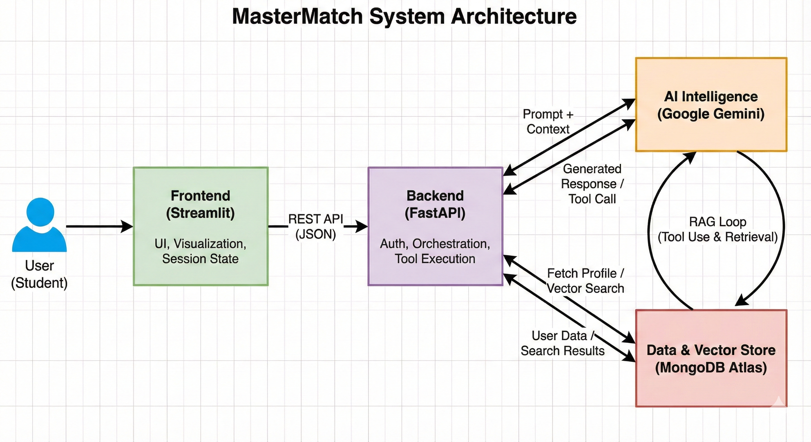

# MasterMatch Architecture & Technical Specification

## 1. High-Level Overview

MasterMatch is designed as a **Client-Server** application that leverages **Retrieval-Augmented Generation (RAG)** to provide accurate, data-driven academic advice. The system decouples the user interface from the business logic, ensuring scalability and maintainability.

The core philosophy is **"Context-Aware AI"**: effectively injecting user data (CV, budget, preferences) into the LLM's context window to minimize generic responses and maximize personalization.

## 2. System Architecture Diagram

*Figure 1: High-level data flow of the MasterMatch application.*

## 3. System Layers

The application is structured into four distinct layers to enforce separation of concerns:

### **A. Presentation Layer (Frontend)**
* **Technology:** Streamlit (`app.py`)
* **Responsibility:** Handles user interaction, state management (session history), and visual rendering of data (maps, cards, chat bubbles).
* **Communication:** Interacts with the backend exclusively via REST API calls.

### **B. Service Layer (Backend)**
* **Technology:** FastAPI (`backend/main.py`)
* **Responsibility:** Acts as the orchestrator. It handles authentication, validates requests, manages sessions, and routes data between the Database and the AI Agent.
* **Security:** Implements JWT (JSON Web Token) authentication to secure endpoints.

### **C. Intelligence Layer (AI)**
* **Technology:** Google Gemini 1.5 Flash (`ai_client.py`) & Langfuse
* **Responsibility:** The reasoning engine. It interprets natural language, decides when to fetch external data (Agentic workflow), and synthesizes answers.
* **Observability:** Langfuse traces every step of the AI's execution to monitor latency, costs, and tool usage accuracy.

### **D. Data Layer (Storage)**
* **Technology:** MongoDB Atlas
* **Responsibility:** Stores persistent data (User Profiles, Chat Logs) and high-dimensional vector embeddings for the semantic search engine.

---

## 4. Data Models

We utilize a **Document-Oriented** database (MongoDB) to handle flexible user profiles and unstructured curriculum data.

### 4.1. User Collection (`users`)
Stores authentication data and the "Student Profile" used for context injection.

| Field | Type | Description |
| :--- | :--- | :--- |
| `_id` | ObjectId | Unique identifier |
| `username` | String | Unique login handle |
| `password_hash` | String | Bcrypt hashed password |
| `profile` | Object | Nested object containing `gpa`, `budget`, `city`, `interests` |
| `cv_text` | String | Extracted text from uploaded PDF CVs |

### 4.2. Masters Collection (`masters_portugal`)
This collection supports **Vector Search** via the `embedding` field.

| Field | Type | Description |
| :--- | :--- | :--- |
| `master` | String | Name of the Master's program |
| `university` | String | Name of the institution |
| `tuition` | Float | Annual cost in Euros |
| `location` | String | City coordinates for map visualization |
| `embedding` | Array | 768-dimensional vector generated by `text-embedding-004` |

---

## 5. Key Technical Decisions & Trade-offs

### 1. MongoDB Atlas
* **Decision:** We chose MongoDB Atlas as our primary database.
* **Justification:** The project requires storing highly unstructured data (CV text, varied university course descriptions). A NoSQL document model offers the flexibility to evolve the schema without migrations.
* **Vector Search:** Atlas provides native Vector Search capabilities, allowing us to perform semantic retrieval without maintaining a separate infrastructure.

### 2. Streamlit
* **Decision:** Streamlit was selected for the frontend.
* **Justification:** While React offers more customization, Streamlit allows for extremely rapid development of data-heavy components (like interactive maps and chat interfaces) entirely in Python. This reduced the "Time to Hello World" significantly for a data science-focused team.

### 3. FastAPI for Backend Decoupling
* **Decision:** We implemented a standalone API instead of a monolithic Streamlit app.
* **Justification:** This adheres to professional software standards. It ensures the business logic is not tied to the UI thread, allows for asynchronous processing (crucial for AI latency), and enables the backend to serve other clients (e.g., a mobile app) in the future.

### 4. Langfuse for Observability
* **Decision:** Integrated Langfuse for tracing.
* **Justification:** "Black box" AI behavior is a major risk. Langfuse allows us to inspect exactly what tools Gemini called and what context was injected, making debugging hallucinations significantly easier than relying on print statements.

---